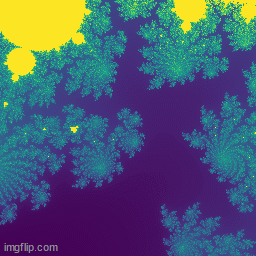

# Mandelbrot Zoom via Neural Network
Since using existing data sets can be boring, one might have the wish to create an own data set.
The mandelbrot set is described by the diverging behaviour of the recursion
```
z0 = 0
z_{n+1} = z_n^2 + c
```
where c is the pixel position on the complex plane.<br>
Since the interesting locations for a zoom in are very sparse, a neural network can be deployed to find interesting spots.<br>

## Curiousity mechanism
In the science of (computer game) agents, neural networks with a sense of curiousity have been developed.
By sending an image through an autoencoder (approximation of the identity with a bottleneck), we can test
how "curious" the network is about this image. If it is new to the network, there will be a high L2 loss between the original input image and the autoencoder's output. If, in the opposite case, the L2 loss is low, it means that
the network has already seen images similar to the one given.<br>
While the agent is going through a level, the autoencoder is trained on the image the agent sees.

<p align="center">

</p>